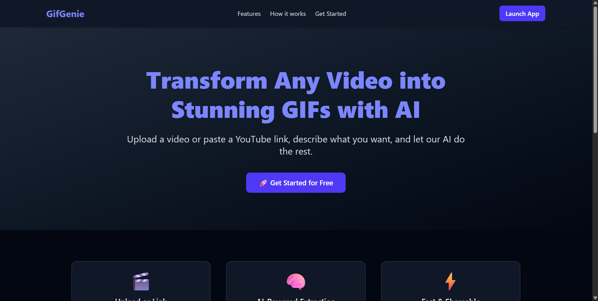
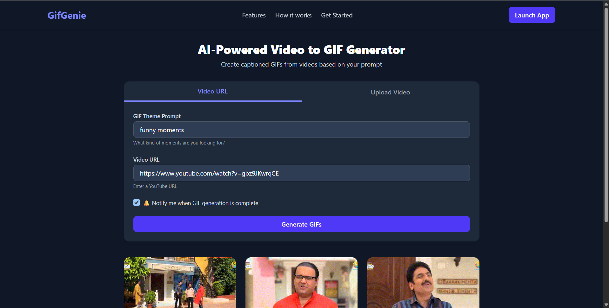
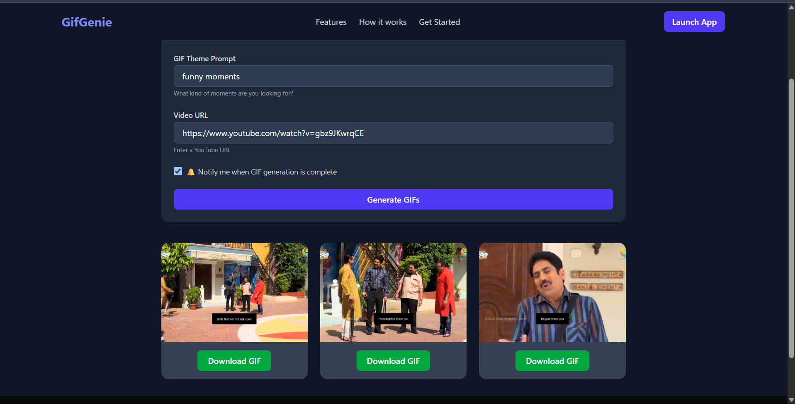

# AI-Powered Video to GIF Generator 🎥➡️📸

A full-stack web application that automatically generates captioned GIFs from YouTube videos or uploaded files using AI.

---

## 📸 Preview







---

## 🌟 Features

- 🎞️ Upload a video or paste a YouTube link
- 💬 Describe what you want (e.g., "funny moments", "motivational quotes")
- 🧠 AI processes the video and finds relevant clips
- ✂️ Converts those clips into captioned GIFs
- 💾 Allows downloading generated GIFs
- 🔐 Login/signup using Supabase Auth

---

## 🧰 Tech Stack

| Layer    | Technology                                  |
| -------- | ------------------------------------------- |
| Frontend | Next.js, Tailwind CSS, Supabase Auth        |
| Backend  | FastAPI, MoviePy, OpenCV, faster-whisper    |
| Hosting  | (You can deploy to Vercel & Railway/Fly.io) |

---

## ⚙️ Setup Guide

### 1. Clone Repo

```bash
git clone https://github.com/your-username/video-to-gif-ai.git
cd video-to-gif-ai
```

### 2. Setup Environment Variables

Create a .env.local inside frontend/:

```
NEXT_PUBLIC_SUPABASE_URL=https://spnedzyzlwtlfhwgiguj.supabase.co
NEXT_PUBLIC_SUPABASE_ANON_KEY=your_supabase_anon_key
NEXT_PUBLIC_BACKEND_URL=http://localhost:8000
```

### 3. Run Backend

```
cd backend
python3 -m venv venv
source venv/bin/activate
pip install -r requirements.txt
uvicorn main:app --reload
```

Make sure it runs at: http://localhost:8000

### 4. Run Frontend

```
cd frontend
npm install --force
npm run dev
```

Visit the app: http://localhost:3000
