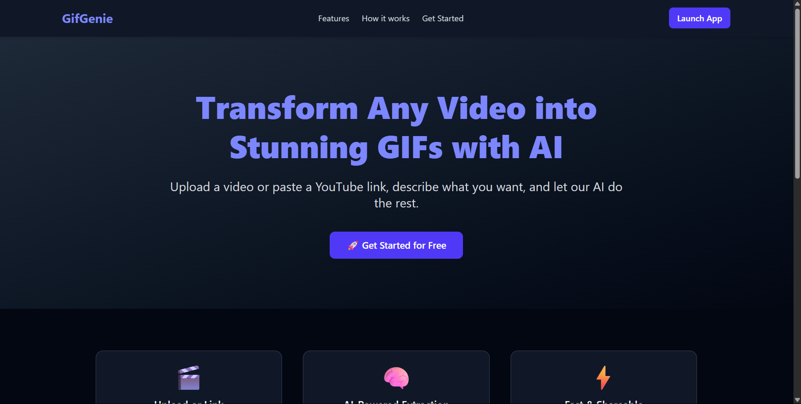
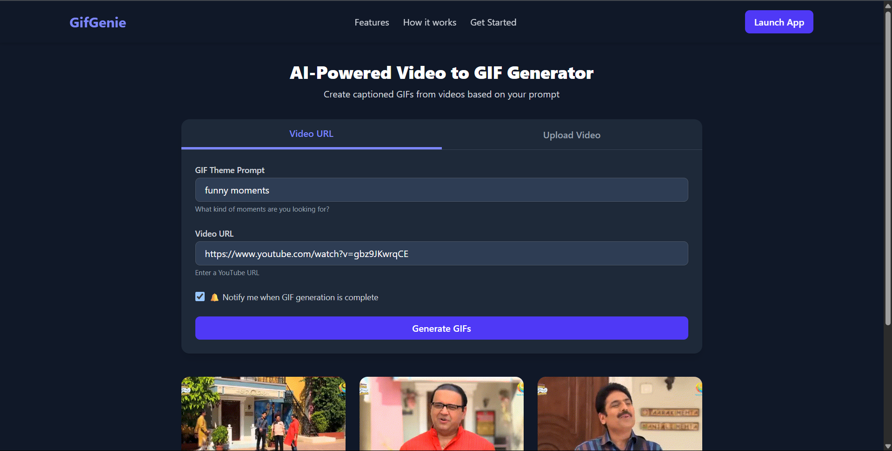
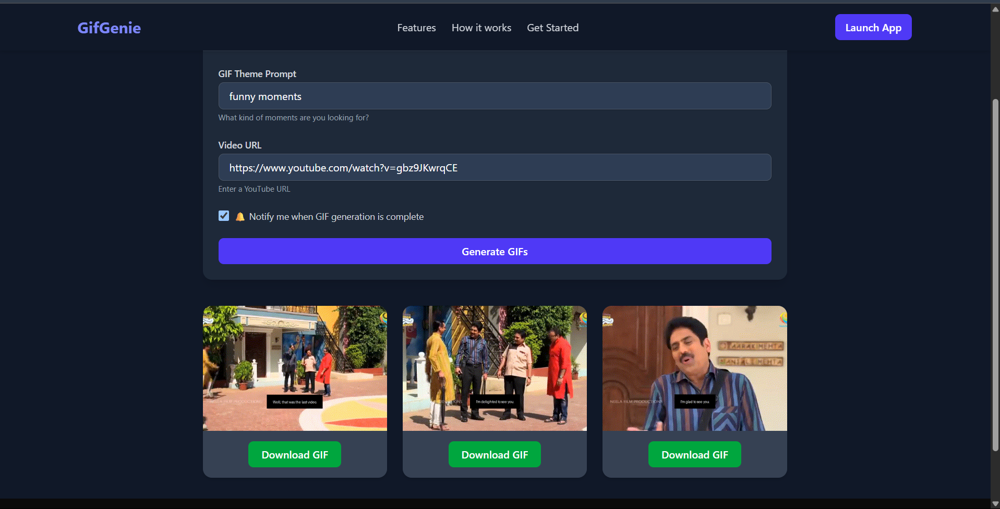

# AI-Powered Video to GIF Generator 🎥➡️📸

A full-stack web application that automatically generates captioned GIFs from YouTube videos or uploaded files using AI.

---

## 📸 Preview







<a href="https://drive.google.com/file/d/1lev6eeZEF6qOKxWmnGovSY7ObH-mTYMK/view" target="_blank">
  
</a>

---

## 🌟 Features

- 🎞️ Upload a video or paste a YouTube link
- 💬 Describe what you want (e.g., "funny moments", "motivational quotes")
- 🧠 AI processes the video and finds relevant clips
- ✂️ Converts those clips into captioned GIFs
- 💾 Allows downloading generated GIFs
- 🔐 Login/signup using Supabase Auth

---

## 🧰 Tech Stack

| Layer    | Technology                           |
| -------- | ------------------------------------ |
| Frontend | Next.js, Tailwind CSS, Supabase Auth |
| Backend  | FastAPI, MoviePy, faster-whisper     |

---

## ⚙️ Setup Guide

### 1. Clone Repo

```bash
git clone https://github.com/your-username/video-to-gif-ai.git
cd video-to-gif-ai
```

### 2. Setup Environment Variables

#### Frontend

Create a `.env` or `.env.local` inside `frontend/` (refer to `.env.example`):

```env
NEXT_PUBLIC_SUPABASE_URL=https://your-project.supabase.co
NEXT_PUBLIC_SUPABASE_ANON_KEY=your_supabase_anon_key
NEXT_PUBLIC_BACKEND_URL=http://localhost:8000
```

#### Backend

Create a `.env` inside `backend/` if required (refer to `.env.example`).

### 3. Run Backend

```
cd backend
python -m venv venv
venv\Scripts\activate  # On Windows
# source venv/bin/activate  # On macOS/Linux
pip install -r requirements.txt
uvicorn app:app --reload
```

Make sure it runs at: http://localhost:8000

### 4. Run Frontend

```
cd frontend
npm install --force
npm run dev
```

Visit the app: http://localhost:3000
